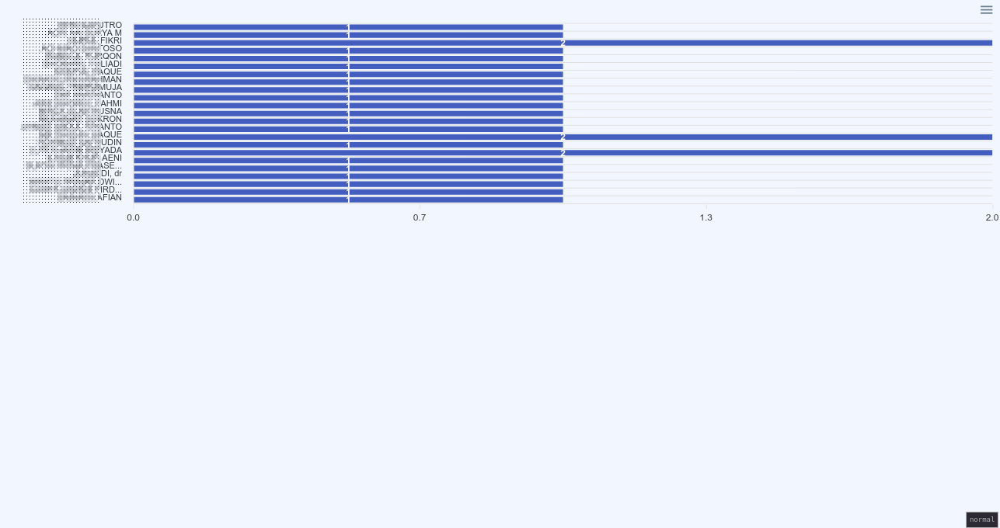

# Laravote

A web-based voting system built with Laravel for organizational elections and decision-making processes.

## Background

Laravote was developed to support voting activities in local community organizations, replacing manual vote counting and simplifying election administration.

## Features

* Secure voter authentication
* Voting session management
* Real-time vote counting

## How it Works

Laravote uses **one screening machine** (with barcode scanner) and **multiple voting booths** (clients). All machines access the same Laravel app.

### Actors
- **Voters** — people who cast votes, identified by a unique barcode/ref code
- **Candidates** — users marked as `candidate = true`, voters pick from these
- **Clients** — voting booth machines, each with a name and password

### Flow

```
┌──────────────────────────────────────────────────────────────┐
│                  SCREENING MACHINE                           │
│                  (barcode scanner)                           │
│                                                              │
│  1. Open /voter — shows barcode input form                  │
│  2. Voter scans their barcode → ref entered automatically    │
│  3. System finds an empty booth, shows:                      │
│     "Silakan menuju ke [booth name]"                         │
│  4. Voter walks to their assigned booth                     │
└──────────────────────────────────────────────────────────────┘
                         │
                         │ Queue entry created (voter → booth)
                         ▼
┌──────────────────────────────────────────────────────────────┐
│                   VOTING BOOTH (client)                      │
│                                                              │
│  1. Booth operator logs in at /client → password             │
│  2. Redirected to /check — polls every 3s:                   │
│     "Harap tunggu sebentar..."                               │
│  3. When voter is assigned → auto-redirects to voting page   │
│  4. Voter selects candidates, submits → votes recorded       │
│  5. Booth goes back to /check, ready for next voter          │
└──────────────────────────────────────────────────────────────┘
```

### Behind the Scenes
- **Voter scanned** → `POST /login` dispatches `VoterValidated`, which creates a `Queue` entry linking voter to an empty booth
- **Booth polls** → `GET /check` (every 3s via HTMX) picks up the Queue entry, marks booth as occupied (`is_empty = false`)
- **Vote cast** → `POST /votes` inserts into `votes` table, marks queue as `is_done = true`, booth becomes empty again
- **Events**: `SlotOccupied` / `SlotAvailable` toggle the `clients.is_empty` flag on each booth

## Under Development
* Candidate management
* Result reporting
* Dashboard

## Use Cases

This system has been used for organizational voting activities, including youth and community organizations.

## Technology Stack

* Laravel
* PHP
* sqlite
* Bootstrap
* HTMX

## Screenshots

### Voter Screening


### Voter Assigned to Booth


### Voting Page


### Live-count Page



## Installation

```bash
git clone https://github.com/atmorojo/Laravote.git
cd Laravote

composer install
cp .env.example .env

php artisan key:generate
php artisan migrate

php artisan serve
```

## Project Status

There are a lot to improve, but it's used in real organizational voting workflows.

## Acknowledgements
[Mazer](https://github.com/zuramai/mazer)
